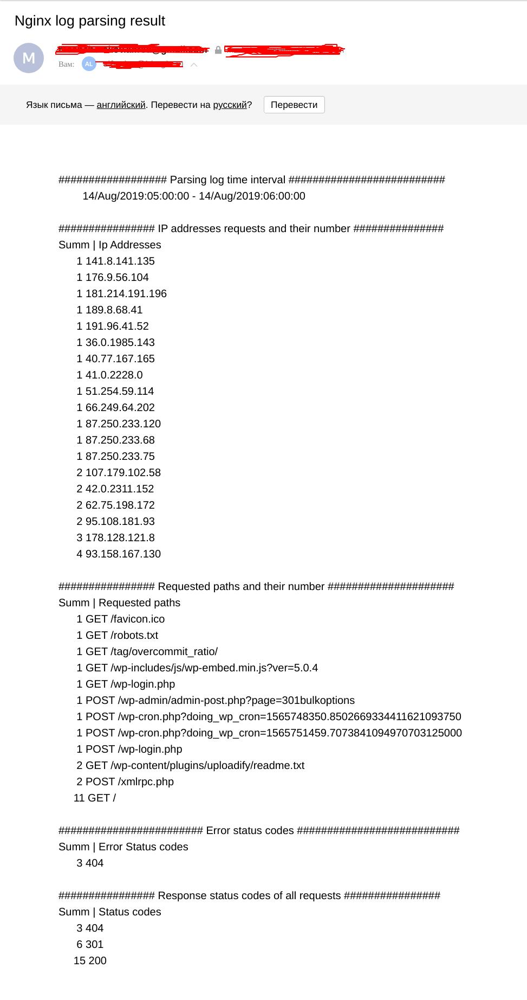

## If running command "vagrant up" then copy two files (log and script) on VM:
```
bash.vm.provision "file", source: "./access.log", destination: "$HOME/access.log"
bash.vm.provision "file", source: "./log_parser.sh", destination: "$HOME/log_parser.sh"
```
## Then provisioning script for install mail sender (and modify conf file), create counter and configure crontab:
```
$bootstrap = <<SCRIPT
yum install epel-release -y
yum install -y mailx
ln -s /bin/mailx /bin/email
cat << EOF > /etc/mail.rc
set smtp=smtps://smtp.gmail.com:465
set smtp-auth=login
set smtp-auth-user=example@gmail.com
## in case you want to configure a Gmail account with 2Factors enabled, it is needed to you the Google APP PASSWORD:
set smtp-auth-password=Google_APP_PASSWORD
set ssl-verify=ignore
EOF
echo "4" > var.txt && chmod +x log_parser.sh
echo "0 * * * *	root	/home/vagrant/log_parser.sh" >> /etc/crontab
SCRIPT
--------------------------------------------------------------------------------------------------------------------------
bash.vm.provision "shell", inline: $bootstrap
```
## Every hour crontab run script for parsing Nginx log (log_parser.sh).
## First assigned counter, it remembers the current hour and when the cycle passes, it adds an hour for the next start:
```
i=$(cat var.txt)
    ...
echo $((i+1)) > var.txt
```
## When assigning a counter, the log analysis cycle goes.
## IP addresses (with the largest number of requests) indicating the number of requests since the last start of the script:
```
ip_addresses=$(cat access.log | grep "14/Aug/2019:0$i" | grep -o "[0-9]\+\.[0-9]\+\.[0-9]\+\.[0-9]\+" | sort | uniq -c | sort -n)
```
## Requested paths (with the largest number of requests) indicating the number of requests since the last launch:
```
requested_paths=$(cat access.log | grep "14/Aug/2019:0$i" | grep -Eo "(GET|POST) \S+" | sort | uniq -c | sort -n)
```
## All errors since the last launch:
```
error_status_codes=$(cat access.log | grep "14/Aug/2019:0$i" | grep -Eo "\" (4[0-9][0-9]|5[0-9][0-9]) " | sort | uniq -c | sort -n | tr -d '"')
```
## A list of all return codes with an indication of their number since the last launch:
```
all_status_codes=$(cat access.log | grep "14/Aug/2019:0$i" | grep -o "\" [2-5][0-9][0-9] " | sort | uniq -c | sort -n | tr -d '"')
```
## Then sending mail parsing result this Nginx log with parsing log time interval:
```
################## Parsing log time interval ##########################
        14/Aug/2019:0$i:00:00 - 14/Aug/2019:0$((i+1)):00:00

################ IP addresses requests and their number ###############
Summ    |     Ip Addresses
$ip_addresses

################ Requested paths and their number #####################
Summ    |     Requested paths
$requested_paths

######################## Error status codes ###########################
Summ    |     Error Status codes
$error_status_codes

################ Response status codes of all requests ################
Summ    |     Status codes
$all_status_codes
```
# example of received letter
<br>
