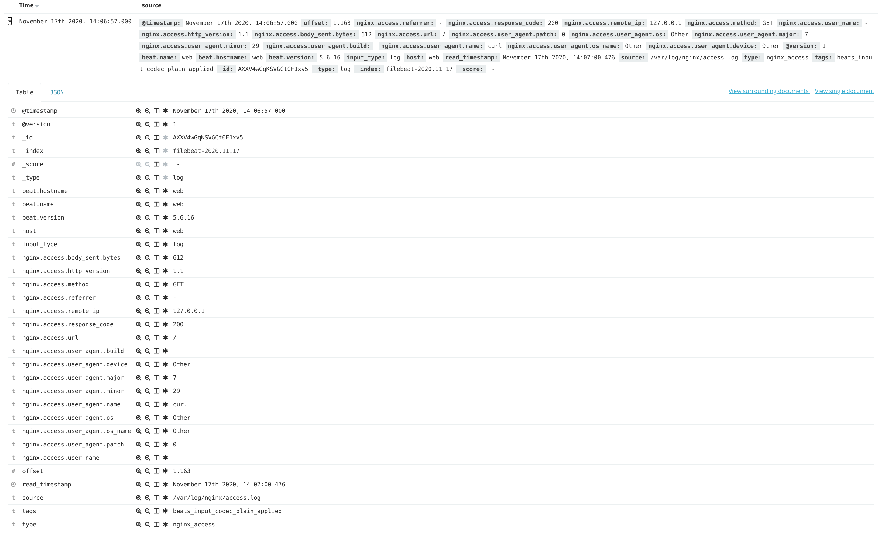
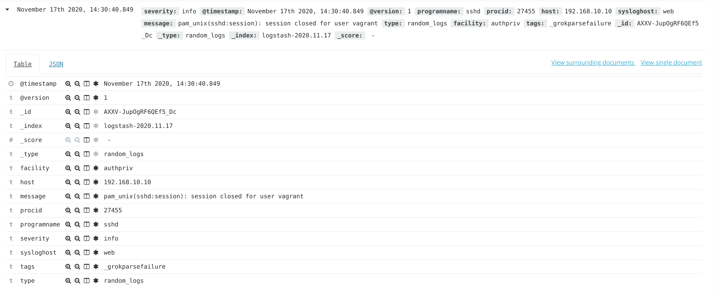

## After run "vagrant up" firts provision ansible role web on web host:
```
- hosts: web
  remote_user: vagrant
  become: true
  become_method: sudo
  become_user: root
  roles:
    - roles/web
```
## This role installs the nginx web server and configures rsyslog to parse all logs and audit logs for this service then push on log server.

## This block configure rsyslog for all logs on web server and push only critical logs on log server:
```
- name: JSON logging format
  copy: src=json-template.conf dest=/etc/rsyslog.d/01-json-template.conf

- name: Added rsyslog.d/critical_log.conf
  copy: src=critical_log.conf dest=/etc/rsyslog.d/60-output.conf

- name: Replace rsyslog.conf
  copy: src=rsyslog.conf dest=/etc/rsyslog.conf

- name: Change selinux mode by syslogd_t on permissive
  shell: semanage permissive -a syslogd_t

- name: rsyslog.service restarted
  service: name=rsyslog.service state=restarted

- name: syslog of nginx to srvlog
  copy: src=nginx_syslog.conf dest=/etc/rsyslog.d/nginx.conf

- name: Ensure rsyslog is running and enabled
  service: name=rsyslog state=restarted enabled=yes
```

## This block apply nginx rule for audit log:
```
- name: Enabled audit of nginx.configs
  copy: src=nginx.rules dest=/etc/audit/rules.d/nginx.rules

- name: Ensure auditd is running and enabled
  service: name=auditd state=restarted use=service
```

## This block install and configure filebeat agent for parse nginx logs:
```
- name: Repo elastic
  copy: src=elastic.repo dest=/etc/yum.repos.d/elastic.repo

- name: Install FileBeats client
  yum: pkg=filebeat state=latest

- name: Config has just replaced into filebeat/filebeat.yml
  copy: src=filebeat.yml dest=/etc/filebeat/filebeat.yml

- name: Ensure filebeat.service is running and enabled
  service: name=filebeat state=restarted enabled=yes
```

## Second provision role for log server:
```
- hosts: log
  remote_user: vagrant
  become: true
  become_method: sudo
  become_user: root
  roles:
    - roles/log
```

## This role sets up the ELK stack. Installation of all distributions begins:
```
- name: repo=elastic was added
  copy: src=elastic.repo dest=/etc/yum.repos.d/elastic.repo

- name: Install packages ELK stack
  yum: pkg={{ item }} state=latest
  with_items:
    - java-1.8.0-openjdk
    - elasticsearch
    - logstash
    - kibana
    - unzip
```

## ElasticSearch installation by default. So, let's go to the step of configuring logstash for parse all critical log from rsyslog and all log from nginx:
```
- name: logstash.yml was inserted
  copy: src=logstash.yml dest=/etc/logstash/logstash.yml

- name: Copy nginx parse conf
  copy: src=nginx.yml dest=/etc/logstash/conf.d/nginx.yml

- name: Copy rsyslog parse conf
  copy: src=rsyslog.yml dest=/etc/logstash/conf.d/rsyslog.yml

- name: logstash.service was restarted
  service: name=logstash.service state=restarted enabled=yes
```

## And finaly install and configure kibana service:
```
- name: kibana.yml was inserted
  copy: src=kibana.yml dest=/etc/kibana/kibana.yml

- name: kibana.service was restarted
  service: name=kibana.service state=restarted enabled=yes
```

## This screen show log in kibana UI from nginx service:
<br>

## This screen show log in kibana UI from web server (rsyslog). This example is for information-level logging:
<br>
