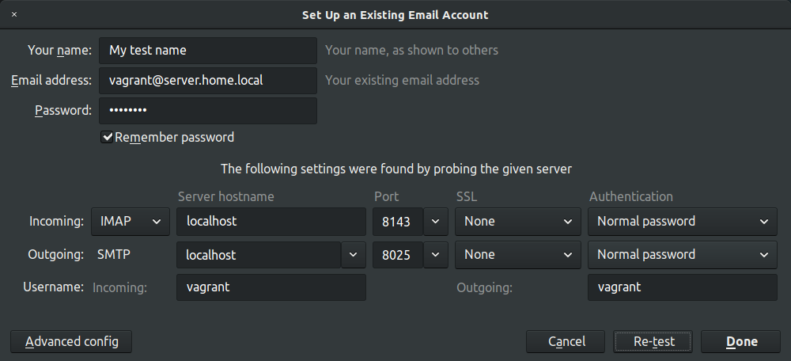
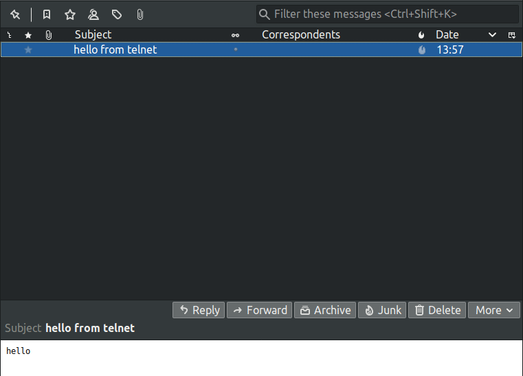

## SMTP, IMAP, POP3

### Task

1. Install postfix + dovecot in the virtual machine to receive mail on the virtual domain in any way discussed at the seminar.
2. Send mail via telnet from host to virtual machine.
3. Receive mail to the host by the mail client.

### Solution
1. Setup environment
    ```bash
    vagrant up
    ```

1. Send email with telnet from localhost
    ```bash
    telnet localhost 8025

    ehlo server.home.local
    mail from: username@example.com
    rcpt to: vagrant@server.home.local
    data
    Subject: hello from telnet
    hello
    .
    ```

1. View inbox via IMAP
    ```bash
    telnet localhost 8143
    a login vagrant password
    b select inbox
    ```

1. Connect with thunderbird

  * settings (password: "password")

  

  * result

  
