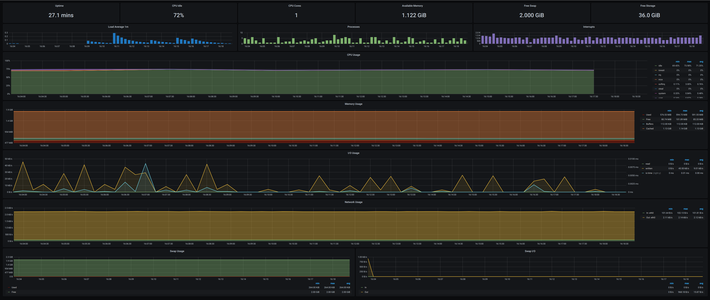
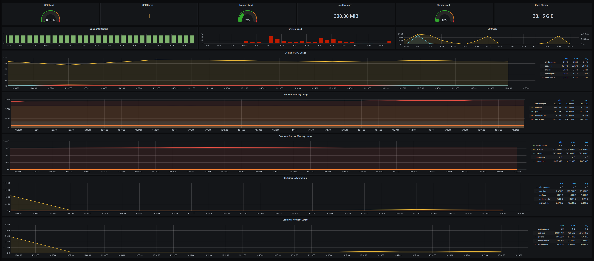

## When run "vagrant up" then copy dockprom dir with monitoring project to home dir vagrant user:
```
monitoring.vm.provision "file", source: "./dockprom", destination: "dockprom"
```

## Later provision script installed docker and docker-compose:
```
$bootstrap = <<SCRIPT
yum install -y yum-utils
yum-config-manager --add-repo https://download.docker.com/linux/centos/docker-ce.repo
yum install docker-ce docker-ce-cli containerd.io -y
systemctl enable docker
systemctl start docker
curl -L "https://github.com/docker/compose/releases/download/1.27.4/docker-compose-$(uname -s)-$(uname -m)" -o /usr/local/bin/docker-compose
chmod +x /usr/local/bin/docker-compose
ln -s /usr/local/bin/docker-compose /usr/bin/docker-compose
SCRIPT

    ...

monitoring.vm.provision "shell", inline: $bootstrap
```

## Third provisioning script starts monitoring project in docker-compose orchestrator:
```
monitoring.vm.provision "shell", inline: <<-SHELL
cd dockprom/
docker-compose up -d
docker-compose ps
SHELL
```

## If you see this output message then monitoring stack running:
```
monitoring:     Name                  Command                       State                   Ports
monitoring: ----------------------------------------------------------------------------------------------
monitoring: alertmanager   /bin/alertmanager --config ...   Up                      0.0.0.0:9093->9093/tcp
monitoring: cadvisor       /usr/bin/cadvisor -logtostderr   Up (health: starting)   0.0.0.0:8080->8080/tcp
monitoring: grafana        /run.sh                          Up                      0.0.0.0:3000->3000/tcp
monitoring: nodeexporter   /bin/node_exporter --path. ...   Up                      9100/tcp
monitoring: prometheus     /bin/prometheus --config.f ...   Up                      0.0.0.0:9090->9090/tcp
```

## Monitoring services are available at the following URLs:
### Grafana: [http://grafana](http://localhost:3100/)
### Prometheus: [http://prometheus](http://localhost:9190/)
### AlertManager: [http://alertmanager](http://localhost:9193/)
### cAdvisor: [http://cadvisor](http://localhost:8180/)


# ***Docker Host Dashboard***

<br>

The Docker Host Dashboard shows key metrics for monitoring the resource usage of your server:

* Server uptime, CPU idle percent, number of CPU cores, available memory, swap and storage
* System load average graph, running and blocked by IO processes graph, interrupts graph
* CPU usage graph by mode (guest, idle, iowait, irq, nice, softirq, steal, system, user)
* Memory usage graph by distribution (used, free, buffers, cached)
* IO usage graph (read Bps, read Bps and IO time)
* Network usage graph by device (inbound Bps, Outbound Bps)
* Swap usage and activity graphs


# ***Docker Containers Dashboard***

<br>

The Docker Containers Dashboard shows key metrics for monitoring running containers:

* Total containers CPU load, memory and storage usage
* Running containers graph, system load graph, IO usage graph
* Container CPU usage graph
* Container memory usage graph
* Container cached memory usage graph
* Container network inbound usage graph
* Container network outbound usage graph
