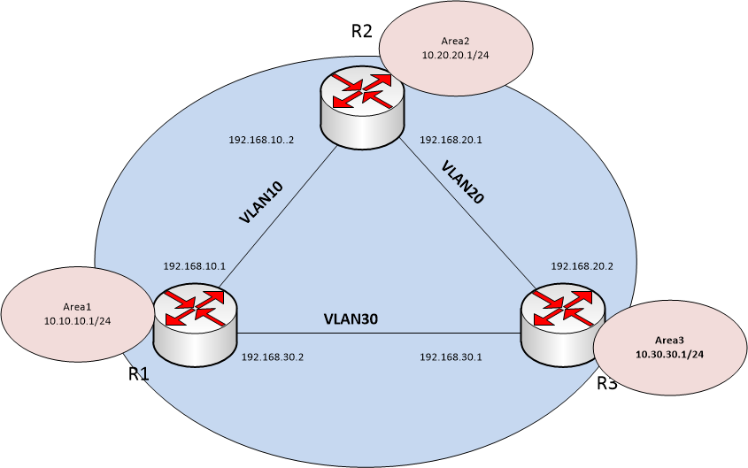
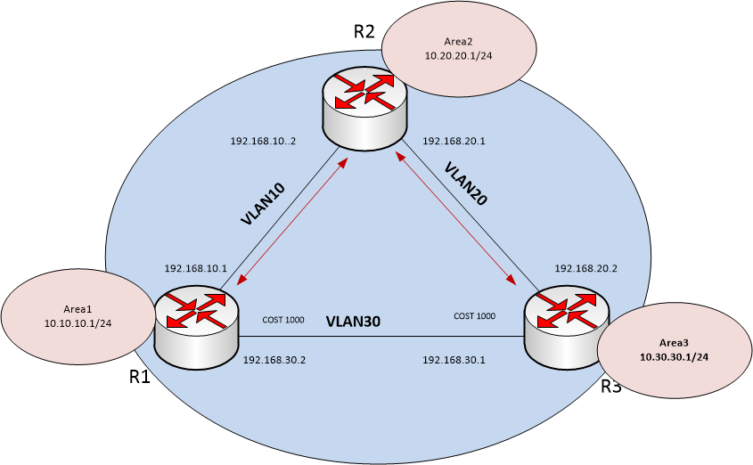

## Task 1.
### Connect OSPF between Quagga machines using the following command:
```
$ ./run_task.sh task1
```
### After that, there will be three virtual machines with configured OSPF.
<br>

### R1 >> R3
```
[vagrant@R1 ~]$ tracepath 10.30.30.1
 1?: [LOCALHOST]                                         pmtu 1500
 1:  10.30.30.1                                            2.174ms reached
 1:  10.30.30.1                                            2.198ms reached
     Resume: pmtu 1500 hops 1 back 1
```

### R3 >> R1
```
[vagrant@R3 ~]$ tracepath 10.10.10.1
 1?: [LOCALHOST]                                         pmtu 1500
 1:  10.10.10.1                                            0.880ms reached
 1:  10.10.10.1                                            2.089ms reached
     Resume: pmtu 1500 hops 1 back 1
```

## Task 2.
### To display asymmetric routing use the following command:
```
$ ./run_task.sh task2
```
### After that we get just such a network architecture:
<br>

### R1 >> R3
```
[vagrant@R1 ~]$ tracepath 10.30.30.1
 1?: [LOCALHOST]                                         pmtu 1500
 1:  192.168.10.2                                          1.645ms
 1:  192.168.10.2                                          1.775ms
 2:  10.30.30.1                                            3.709ms reached
     Resume: pmtu 1500 hops 2 back 2
```

### R3 >> R1
```
[vagrant@R3 ~]$ tracepath 10.10.10.1
 1?: [LOCALHOST]                                         pmtu 1500
 1:  10.10.10.1                                            0.684ms reached
 1:  10.10.10.1                                            2.020ms reached
     Resume: pmtu 1500 hops 1 back 1
```

## Task 3.
### Make one of the links "expensive", but make the routing symmetric with the following command:
```
$ ./run_task.sh task3
```
### by this we will hang the "cost 1000" on vlan30 on R1 and R3:
<br>

### R1 >> R3
```
[vagrant@R1 ~]$ tracepath 10.30.30.1
 1?: [LOCALHOST]                                         pmtu 1500
 1:  192.168.10.2                                          2.386ms
 1:  192.168.10.2                                          1.910ms
 2:  10.30.30.1                                            3.732ms reached
     Resume: pmtu 1500 hops 2 back 2
```

### R3 >> R1
```
[vagrant@R3 ~]$ tracepath 10.10.10.1
 1?: [LOCALHOST]                                         pmtu 1500
 1:  192.168.20.1                                          1.837ms
 1:  192.168.20.1                                          1.948ms
 2:  10.10.10.1                                            3.585ms reached
     Resume: pmtu 1500 hops 2 back 2
```
